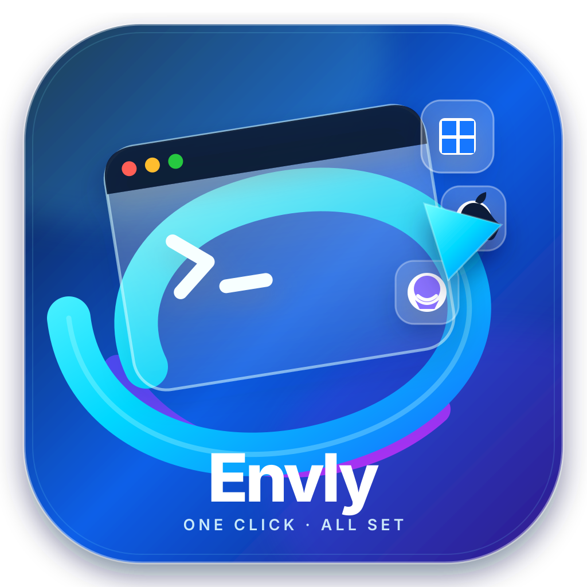

<p align="right"><b><a href="README.en.md">English</a></b> · <b>简体中文</b></p>

<p align="center">
  
</p>

<h1 align="center">Envly</h1>

<p align="center">
  <strong>一键开发环境配置桌面工具</strong><br>
  Windows · macOS · Linux
</p>

<p align="center">
  
  
  
</p>

Envly 帮你用一次点击完成开发环境安装与系统环境配置：选模板、勾选清单、一键配置、实时日志、执行报告，全部在一个 Apple Liquid Glass 风格的单页向导里完成。海外网络自动跳过镜像源，界面中英双语。

## 下载

前往 [Releases](https://github.com/tanzhijir-04/Envly/releases) 下载对应平台安装包：

- **Windows**：`Envly_1.0.0_x64_zh-CN.msi`（安装包）或 `Envly.exe`（免安装）
- **macOS**：`Envly.dmg`
- **Linux**：`envly.deb`（Debian/Ubuntu）或 `envly.AppImage`

> macOS / Linux 版为「Pake 壳 + 独立引擎」双进程结构，请先运行对应的 `envly-engine-*` 二进制再启动应用（后续版本将内置一键启动器）。

## 功能特性

- **单页向导**：模板 → 勾选 → 一键配置 → 实时日志，全流程一个页面
- **真实安装**：winget / npm / pip / rustup / download，已安装自动跳过
- **环境配置**：npm/pip 镜像、GitHub 加速/代理、PowerShell Profile、PATH，变更可审计、可一键还原
- **区域自适应**：自动检测网络区域，海外不强制切换镜像
- **执行报告**：安装记录与环境变更一目了然
- **桌面体验**：无边框窗口、自绘窗口控件、22px 圆角、Liquid Glass 非线性动效
- **中英双语**：界面语言即时切换

## 快速开始（开发）

前置：Go 1.23+、Node 18+。

```bash
# 1. 启动引擎（同时托管前端）
cd engine
go run ./cmd/envly -web-dir ../ui

# 2. 浏览器打开
http://127.0.0.1:17521
```

开发模式（模拟执行，不安装真实软件）：

```bash
go run ./cmd/envly -web-dir ../ui -simulate
```

## 技术栈

| 层 | 技术 |
| --- | --- |
| 引擎 | Go 1.23（仅标准库：net/http、SSE、Win32 syscall） |
| 前端 | 原生 HTML/CSS/JS（无框架），Apple Liquid Glass 设计语言 |
| 动效 | GSAP（非线性缓动，遵循 Liquid Glass motion 规范） |
| 桌面壳 | Pake（基于 Tauri / WebView2） |
| 构建发布 | GitHub Actions（Windows / macOS / Linux 原生 runner） |
| 测试 | Go test · Vitest |

## 目录结构

```
Envly/
├─ engine/                    # Go 引擎：本地 HTTP 服务 + 全部业务逻辑
│  ├─ cmd/envly/              # 引擎入口（启动服务、窗口控制守护）
│  └─ internal/
│     ├─ api/                 # REST API + SSE 实时日志 + 静态托管
│     ├─ config/              # 数据驱动的工具清单与模板
│     ├─ env/                 # 镜像/代理/Profile/PATH 配置与还原
│     ├─ events/              # SSE 事件中心
│     ├─ executor/            # 执行器（模拟 / 真实安装）
│     ├─ installer/           # 安装分发（winget/npm/pip/rustup/download）
│     ├─ network/             # 网络区域探测（大陆/海外）
│     ├─ runner/              # 命令执行抽象
│     ├─ state/               # 设置持久化
│     ├─ store/               # 安装记录与环境操作日志
│     ├─ verify/              # 安装验证与版本解析
│     └─ windowctrl/          # Windows 窗口控制（无边框/圆角/最小化最大化）
├─ ui/                        # 前端单页应用
│  ├─ src/                    # main/i18n/api/plan/status/motion 模块
│  ├─ vendor/gsap.min.js      # GSAP 动画库（本地化，离线可用）
│  └─ index.html · styles.css
├─ scripts/                   # 图标生成、Pake 打包脚本
├─ assets/                    # 图标资源
├─ docs/                      # 设计文档 / 实施计划 / 需求记录
├─ .github/workflows/         # CI（测试构建）与 release（三平台打包发布）
└─ README.md · README.en.md
```

## 测试

```bash
cd engine && go test ./...
cd ui && npm test
```

## 打包与发布

Windows 本地打包：

```powershell
powershell -ExecutionPolicy Bypass -File scripts/gen-icon.ps1   # 生成图标
# 先启动引擎，再执行：
powershell -ExecutionPolicy Bypass -File scripts/build-pake.ps1 # 产出 msi/exe
```

三平台自动打包：打一个 `v*` 标签推送到 GitHub，[release 工作流](.github/workflows/release.yml) 会在 macOS / Linux / Windows 原生 runner 上构建并挂到对应 Release。

## 路线图

- M1 ✅ 引擎骨架 + 单页向导
- M2 ✅ Windows 真实安装与环境配置
- M3 ✅ 报告 / 还原 / 打包 / CI / Release
- M4 ⏳ macOS（brew）与 Linux（apt）深度适配、一键启动器

## License

MIT
